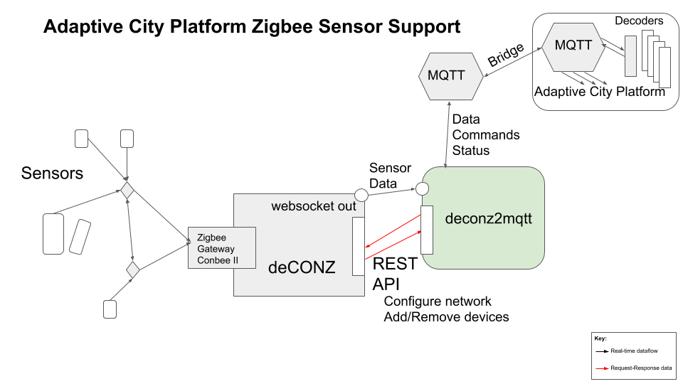

# Conbee II deconz API and websocket access

This is an effort to connect Zigbee sensors to the Adaptive City platform.

A particular challenge is the
usual tight integration between Zigbee networking and the 'application layer', i.e. all software
available for Zigbee hardware seems to need to include a configuration for every single device type
that is connected to the network (WTF?). We will try and ease this restriction, i.e. be more permissive
about allowing devices to connect to the network, and defer dealing with the application-level issues (like
whether the device is a switch or a light bulb) until later in the software stack.

The work-in-progress tracing the `deCONZ REST API` calls is in [PWA API Calls](pwa_api_calls/README.md).

Below is an architectural diagram of how the Adaptive City components will combine
to support Zigbee sensors.

## Decoders

See `acp_decoders` in [acp_local_mqtt](https://github.com/AdaptiveCity/acp_local_mqtt).

There are two particular reasons decoders are necessary in our system:

1. We want consistent reference to sensor identifiers and timestamps. Each sensor manufacturer
(and zigbee controller software) uses its own way of recording an identifier for the
sensor and the timestamp of the reading.

2. Sensor providers are shockingly amateur in dealing with *events*. For example the Xioami Aqara Door/Window
sensor sends a periodic 'state' message (`open: true|false`) every 50 minutes, but sends the *same*
message when the door/window is actually opened or closed. This requires the *application* to maintain state in some
unique way for this sensor. Instead, we add properties `"acp_event": "openclose"`, `"acp_event_value": "open"` where
we believe an actual event has occurred.
