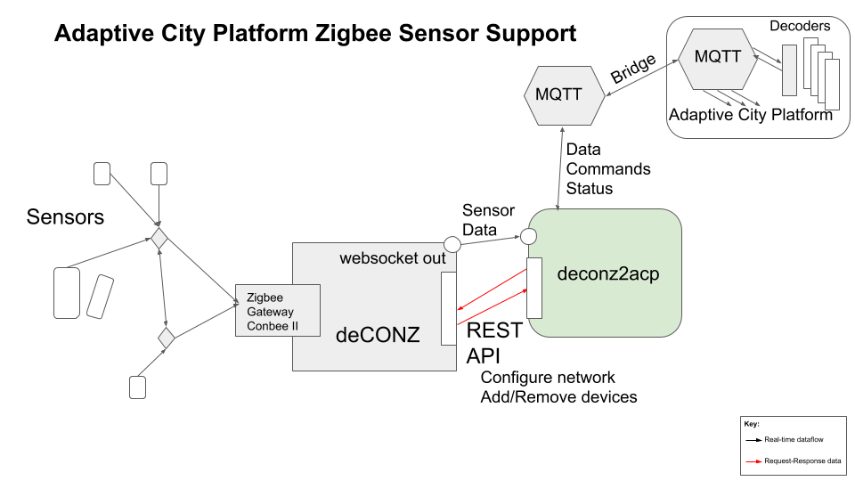

# deconz2acp

`deconz2acp` connects via a websocket and the http REST API of the `deCONZ` software which supports the Conbee II ZigBee coordinator.

`deCONZ` can be run 'headless' as we only need access to the REST API and the websocket.

The objective is to normalize and simplify the sensor/device Json data messages and send them to the Adaptive
City platform via MQTT. Messages *from* the platform can send simple updates to the powered ZigBee devices.



## Requirement

For any data reaching the Adaptive City platform we need a *minimum* of:

1. a 'sensor id' telling us which device the data came from

2. a timestamp most relevant to the data

3. a distinction between messages indicating an 'event' versus routine periodic status messages.

Surprisingly, most consumer sensor software (like deCONZ), and the consumer sensors, fail **all** of the requirements
above.

## Main functions of `deconz2acp`

`deconz2acp`:

1. uses the deCONZ REST API to collect the metadata of the devices connected to the ZigBee network and
uses this to add a system-wide 'sensor id' (actually `acp_id`) to the data, in addition to an accurate timestamp in
`acp_ts`.

2. uses the deCONZ websocket to receive the sensor data in real-time (rather than polling the REST API and
  introducing unnecessary latency)

3. pushes the enriched sensor data up to the Adaptive City Platform via MQTT

4. accepts MQTT messages *from* the Adaptive City Platform to be interpreted as commands affecting either
the local system software or to be transmitted to selected ZigBee devices.

## deCONZ REST API

This supports a small number of simple API calls (see [online docs](https://dresden-elektronik.github.io/deconz-rest-doc/))
allowing the retrieval of metadata regarding the connected ZigBee devices, for example:

To query the status of the network:
```
GET /api/<apikey>/config
```
To retrieve the metadata of all connected `sensors` (battery-powered devices, normally transmit-only):
```
GET /api/<apikey>/sensors
```
To retrieve the metadata of all connected `lights` (powered devices, hence can receive and transmit):
```
GET /api/<apikey>/lights
```
To send data to a device (expressed as 'setting' a property):
```
PUT /api/<apikey>/lights/<id>/state
```
with example request data:
```
{
  "on": true,
  "bri": 180,
  "hue": 43680,
  "sat": 255,
  "transitiontime": 10
}
```

## Example data for various ZigBee devices

Examples of the Json returns for a few example devices are provided in [sensor_data/README.md](../sensor_data/README.md).

## Installation

### Install Conbee II and deCONZ

### Install deconz2acp
As user `acp_prod` get the repo
```
git clone https://github.com/AdaptiveCity/zigbee_sensors
```
Create the python virtual environment
```
cd zigbee_sensors/deconz2acp
python3 -m venv venv
source venv/bin/activate
python3 -m pip install pip --upgrade
python3 -m pip install wheel
python3 -m pip install -r requirements.txt
```
From another server, collect the `zigbee_sensors/deconz2acp/secrets` directory containing `settings.json`,
for example:
```
{
    "deconz_api": { "url": "http://localhost/api/B9FAF065F0/"
                  },

    "input_ws": {  "url": "ws://localhost:443"
                },

    "output_mqtt": { "user": "YOUR MQTT USER",
                    "password": "YOUR MQTT PASSWORD",
                    "host": "localhost",
                    "port": 1883,
                    "topic_prefix": "csn-zigbee/"
                  }
}
```
Test run `deconz2acp` with:
```
./run_dev.sh
```
In another terminal on the MQTT server test running `deconz2acp` with:
```
mosquitto_sub -u MQTTUSER -P MQTTPASSWORD -t '#' -v
```
You should see new messages beginning with your `settings.json` `topic_prefix` e.g. `csn-zigbee/`.

To manually run `deconz2acp`:
```
/home/acp_prod/zigbee_sensors/deconz2acp/run.sh
```

As the `acp_prod` user, create the crontab entry to auto-start `deconz2acp` on boot:
```
crontab -e
```
```
@reboot /home/acp_prod/zigbee_sensors/deconz2acp/run.sh
```


 5027  2020-05-09 11:13:57 ./run_dev.sh
 5028  2020-05-09 11:14:16 sftp ijl20-iot
 5029  2020-05-09 11:14:59 ll
 5030  2020-05-09 11:15:06 cat secrets/settings.json
